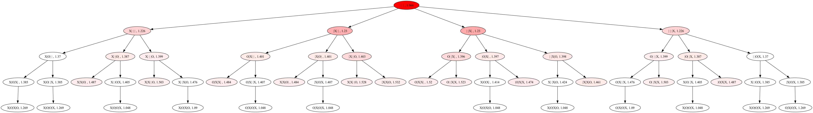

# alphazero

Roughly taking the direction of the [initial AlphaZero paper](https://www.nature.com/articles/nature24270.epdf?author_access_token=VJXbVjaSHxFoctQQ4p2k4tRgN0jAjWel9jnR3ZoTv0PVW4gB86EEpGqTRDtpIz-2rmo8-KG06gqVobU5NSCFeHILHcVFUeMsbvwS-lxjqQGg98faovwjxeTUgZAUMnRQ), with the aim to implement, and understand main methods used.

## MCTS
Monte Carlo Tree Search implemented (I think mostly working correctly), and tested on TicTacToe, and ConnectTwo. Implementation is **very** simple, compared to other versions I found. 

